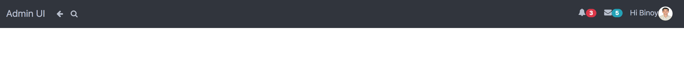
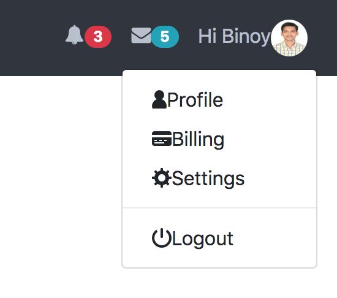
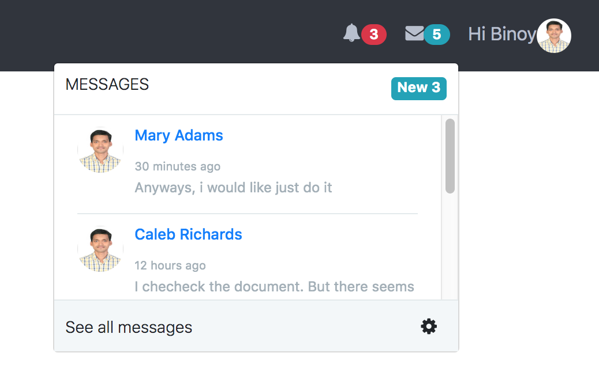
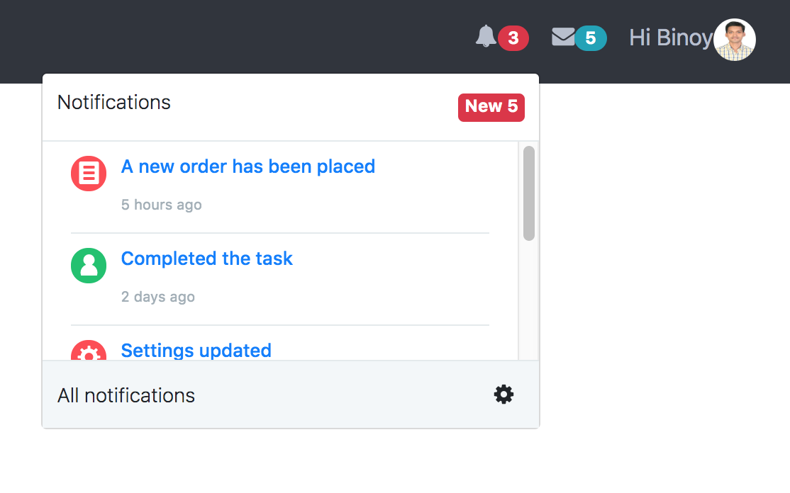

## Introduction
This project contains the fancy top navigation bar developed in react application with bootstrap. This navigation bar fully supported bootstrap 4.0.
## Run Command

* npm start

## Screens
The below screen full view of top navigation bar.

The below screen full view of profile dropdown menu in top navigation bar.

The below screen full view of message dropdown menu in top navigation bar.

The below screen full view of notification dropdown menu in top navigation bar.

## References
* [Admin UI](https://getbootstrapadmin.com/remark/iconbar/pages/email-articles.html)
